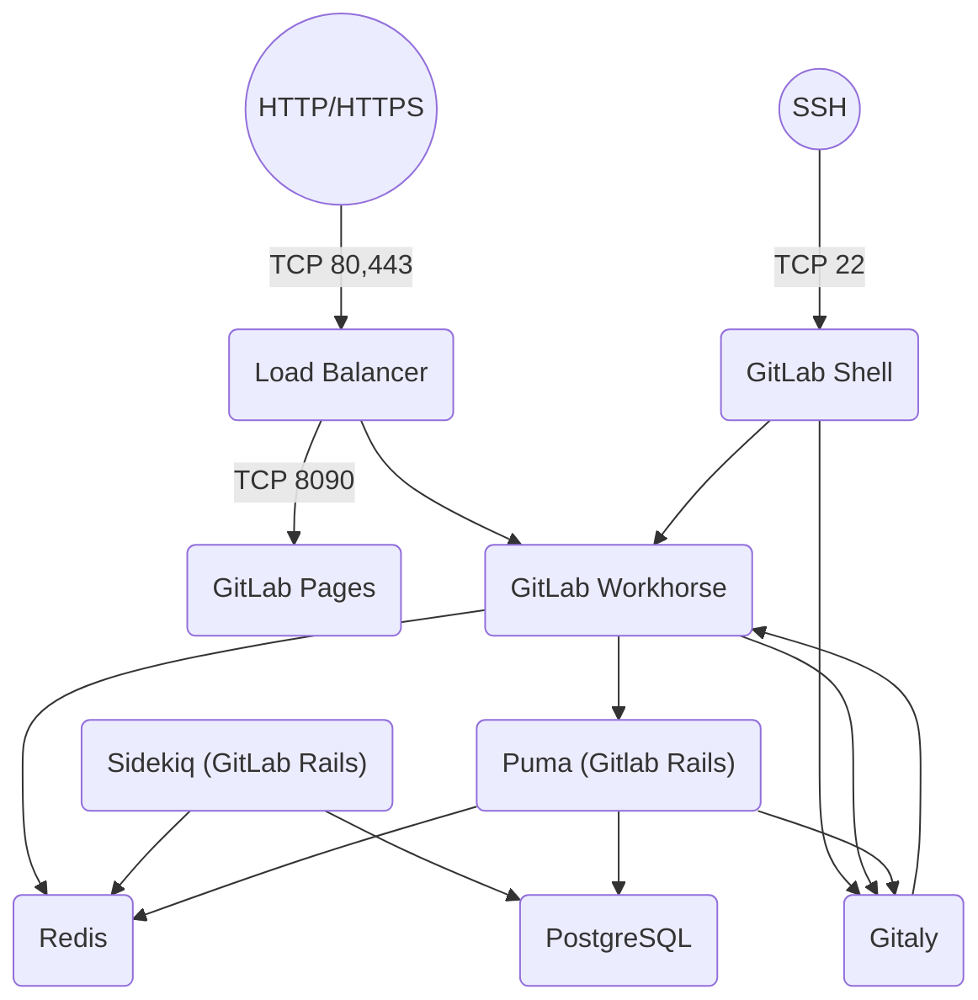

# Architecture

- **Load Balancer**: is used to route requests to GitLab components; for example, you can use an NGINX Ingress controller or an ALB.
- **GitLab Pages**: is a feature that allows you to publish static websites directly from a repository in GitLab.
- **Gitlab Workhorse**: is designed to act as a smart reverse proxy to help speed up GitLab as a whole.
- **GitLab Shell**: is designed to handle SSH-based git sessions, and modifies the list of authorized keys.
- **Puma**: is a Ruby application server that is used to run the core Rails Application that provides the user facing features in GitLab.
- **Sidekiq**: is a Ruby background job processor that pulls jobs from the Redis queue and processes them.
- **Gitaly**: is a service designed to remove the need for NFS for Git storage in distributed deployments of GitLab.
- **Redis**: is used to store the session data, cache data, and background job data.
- **PostgreSQL**: is used to store the data for the GitLab application.

For more detailed information about each component, please refer to the [official GitLab documentation](https://docs.gitlab.com/development/architecture/#simplified-component-overview).

